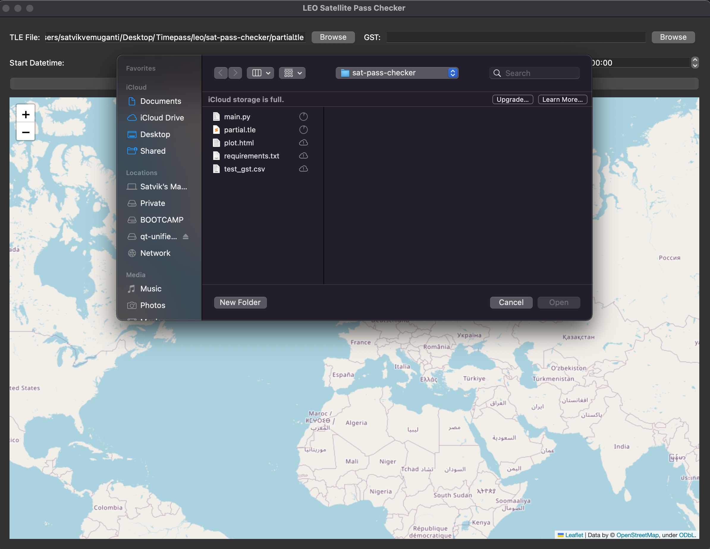

# satellite-pass-checker: A Satellite Pass Checking Tool

The satellite-pass-checker is a GUI application that provides visualizations for the period a Ground Station is active.

A Ground Station is said to be active if it is within a 1000 km Line of Sight (LOS) of a satellite.

### Setup
To run the application, follow these steps:

1. Clone the repository
```bash
git clone git@github.com:VickyMerzOwn/satellite-pass-checker.git
```

2. Install the dependencies
```bash
python -m pip install -r requirements.txt
```

3. Run the application
```bash
python main.py
```

### Usage

Upon running the application, you will be presented with a GUI that looks like this:

<p align="center">
    
</p>

The TLE file and the file containing location (& elevation) data of Ground Stations can be selected from the GUI. The start and end times of the simulation can also be selected from the GUI.

<p align="center">
    
</p>

After selecting both files, the start and end times, click on the `Compute` button to start the simulation.

<p align="center">
    
</p>

Once the simulation is complete, click on the `Plot` button to visualize the simulation. Here are some sample outputs.

<p align="center">
    
</p>
<p align="center">
    
</p>

The above simulations were computed on the following TLE file: [planet_mc_20.tle](./sample-data/planet_mc_20.tle) and the following Ground Station file: [test_gst.csv](./sample-data/test_gst.csv).

The following simulation was conducted on the entire constellation of Planet Labs satellites. The TLE file can be found here: [planet_mc_20.tle](./sample-data/planet_mc_20.tle) and the same Ground Station file as above.

<p align="center">
    
</p>